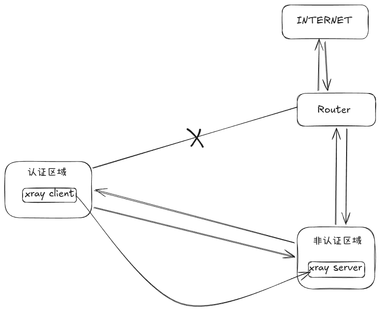

# 介绍

一键登录到校园内网，该工具仅用于登录和登出的用途

## 演示

## 使用方法

重命名 `config.toml.example`  为 `config.toml` 填写你的学号和密码

```toml

[credentials]
# your campus network account
username="202501236"
# your campus network password
password="12345678"

```

需要把配置文件放在统一目录下

```bash

# login
studnetnetpass login

# logout
studnetnetpass logout

```

#### 服务端搭建

- https://github.com/xtls/xray-core#others-that-support-vless-xtls-reality-xudp-plux

#### 客户端环境

- https://github.com/xtls/xray-core#gui-clients


## 工作原理

